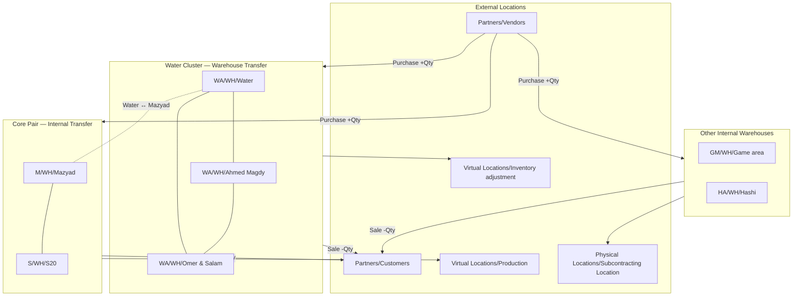
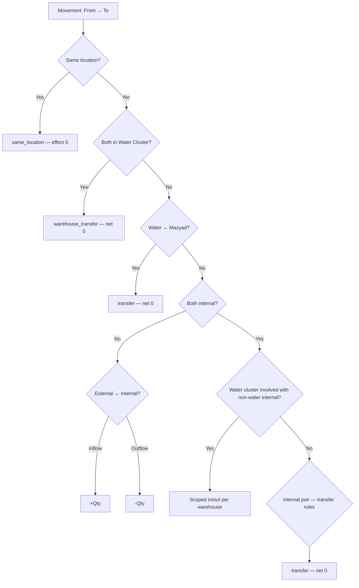

# Inventory Location System

> **Source of truth:** [`locationTypes.ts`](./locationTypes.ts)  
> Used by Products Balance, Categories Balance, Location Movements, and `inventory_service.ts`.

---

## Overview

Every inventory move has **From** and **To** locations. The system classifies each move and calculates stock effect from direction:

| Direction | Stock effect (all locations) |
|-----------|------------------------------|
| External → Internal warehouse | **+Qty** (inflow) |
| Internal warehouse → External | **-Qty** (outflow) |
| Internal → Internal (transfer rules) | **0** (net company-wide) |
| Same location → Same location | **0** (data error, ignored) |

When a **specific warehouse** is selected as filter, effect is scoped per location:

- **To** that location → **+Qty**
- **From** that location → **-Qty**

All location names are normalized via `normalizeLocation()` before any check (e.g. `M/WH/mazyad` → `M/WH/Mazyad`).

---

## Internal Warehouses

| Canonical path | Display name |
|----------------|--------------|
| `WA/WH/Water` | Water |
| `WA/WH/Ahmed Magdy` | Ahmed Magdy |
| `WA/WH/Omer & Salam` | Omer & Salam |
| `M/WH/Mazyad` | Mazyad |
| `S/WH/S20` | S20 |
| `GM/WH/Game area` | Game area |
| `HA/WH/Hashi` | Hashi |

---

## Location Groups & Transfer Rules

### Water Cluster — **Warehouse Transfer**

Transfers among these three only (net **0** company-wide; type `warehouse_transfer`):

```
WA/WH/Water  ↔  WA/WH/Ahmed Magdy  ↔  WA/WH/Omer & Salam
```

### Core pair — **Internal Transfer**

```
M/WH/Mazyad  ↔  S/WH/S20
```

### Special link — **Internal Transfer**

```
WA/WH/Water  ↔  M/WH/Mazyad
```

### Other internal pairs — **Internal Transfer**

Any other internal → internal pair (e.g. Mazyad ↔ Game area) → net **0** company-wide.

### Water cluster ↔ other internal (except Mazyad)

**Not** a transfer. Treated as normal warehouse inflow/outflow when a location is scoped  
(e.g. Water → Game area affects each warehouse separately).

---

## External Locations

### Inflow sources (→ Internal = +Qty)

| Location | Meaning |
|----------|---------|
| `Partners/Vendors` | Purchase from supplier |
| `Partners/Customers` | Customer return |
| `Virtual Locations/Inventory adjustment` | Count gain |
| `Virtual Locations/Production` | Finished goods from production |
| `Physical Locations/Subcontracting Location` | Return from subcontractor |

### Outflow destinations (Internal → = -Qty)

| Location | Meaning |
|----------|---------|
| `Partners/Customers` | Sale to customer |
| `Partners/Vendors` | Return to supplier |
| `Virtual Locations/Inventory adjustment` | Count loss |
| `Virtual Locations/Production` | Raw materials into production |
| `Physical Locations/Subcontracting Location` | Sent to subcontractor |

---

## Architecture Diagram



---

## Classification Flow



---

## Movement Types (reports & ledger)

| Type ID | UI label | Typical flow |
|---------|----------|--------------|
| `vendor_in` | Purchase | Vendors → WH |
| `vendor_return` | Return to Vendor | WH → Vendors |
| `customer_sale` | Sale | WH → Customers |
| `customer_return` | Customer Return | Customers → WH |
| `production_in` / `production_out` | Production In / Out | Production ↔ WH |
| `subcontracting_in` / `subcontracting_out` | Subcontracting In / Out | Subcontracting ↔ WH |
| `adjustment_in` / `adjustment_out` | Adjustment (+) / (-) | Inventory adjustment ↔ WH |
| `warehouse_transfer` | **Warehouse Transfer** | Water ↔ Ahmed Magdy ↔ Omer & Salam |
| `transfer` | **Internal Transfer** | Mazyad↔S20, Water↔Mazyad, other internal pairs |
| `same_location` | **Same Location** | From = To (invalid) |

---

## Balance Calculation

### All locations (no filter)

```
Ending = Opening
       + Net Vendors
       + Net Customers (sales)
       + Net Production
       + Net Adjustment
```

Warehouse and internal transfers net to **0** at company level.

### Single location filter

Period columns use signed scoped effect (`getScopedQtyEffect`):

```
Ending = Opening
       + Net Vendors
       + Net Customers
       + Net Production
       + Net Adjustment
       + Warehouse Transfer
       + Internal Transfer
```

---

## Key Functions

| Function | Purpose |
|----------|---------|
| `normalizeLocation()` | Map DB spellings to canonical names |
| `isSameLocationMove()` | From = To → no effect |
| `isWaterClusterLocation()` | Is location in water cluster? |
| `isWaterClusterTransfer()` | Transfer within water cluster |
| `isWaterMazyadTransfer()` | Water ↔ Mazyad link |
| `isInternalTransfer()` | Internal transfer (0 net aggregate) |
| `getNetQtyEffect()` | Aggregate stock effect (all locations) |
| `getScopedQtyEffect()` | Effect for one selected warehouse |
| `isMoveInLocationScope()` | Does move touch filtered location? |
| `classifyMovement()` | Movement type (general) |
| `MOVEMENT_TYPE_LABELS` | Human-readable labels |

Period reports use parallel logic in `classifyPeriodMovement()` inside `inventory_service.ts`.

---

## Related UI Tabs

| Tab | Path |
|-----|------|
| Products Balance | `ProductsBalance/InventoryProductsBalanceTab.tsx` |
| Categories Balance | `CategoryBalance/InventoryCategoryBalanceTab.tsx` |
| Location Movements In/Out | `LocationMovements/InventoryLocationMovementsTab.tsx` |
| Product ledger | `ProductsBalance/InventoryProductsBalanceDetailsTab.tsx` |

---

## Quick Reference (Arabic)

| Rule | Arabic |
|------|--------|
| Water / Ahmed Magdy / Omer & Salam ↔ each other | **Warehouse Transfer** — مناقلة بين مستودعات المياه |
| Mazyad ↔ S20, Water ↔ Mazyad, other internal | **Internal Transfer** — مناقلة داخلية |
| From = To | **Same Location** — خطأ بيانات |
| External → WH | زيادة (+) |
| WH → External | نقص (−) |
| Location filter | كل عمود يحسب تأثير المخزن المحدد فقط |
